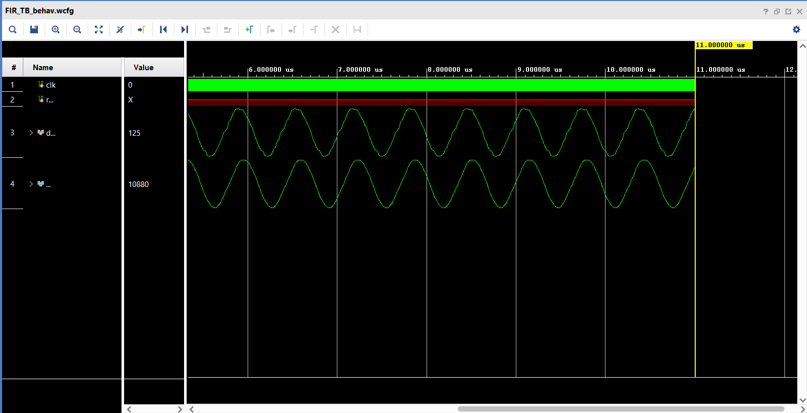
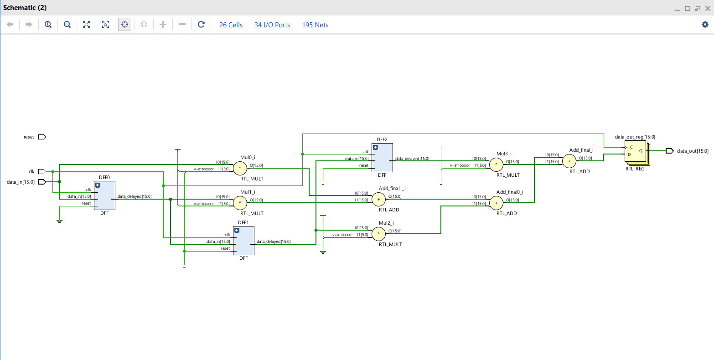

# Filter-Design-With-Xilinx-and-MATLAB

## Project Overview

This project demonstrates the implementation of a **Finite Impulse Response (FIR) Filter** using Verilog. The design focuses on applying a simple moving average filter to a noisy sine wave signal, with the goal of filtering out the noise. The testbench verifies the functionality of the FIR filter with a simulated input waveform.

## Files Included
- **FIR_TB.v**: Verilog testbench for the FIR filter.
- **FIR_Filters.v**: Verilog module implementing the FIR filter.
- **signal.data**: Contains the input sine wave with noise in binary format, used as input for the filter.
- **Fig/**: Folder containing the schematic figure and response of the FIR filter design.

## Project Description

- **Testbench (FIR_TB.v)**:
  - A **16-bit FIR filter** is instantiated and tested.
  - A noisy sine wave signal is read from `signal.data` and stored in a memory array (`RAMM`).
  - A clock signal with a 20ns period is generated to drive the filter.
  - Data from the memory (`RAMM`) is sequentially applied to the input of the FIR filter module on each clock cycle.
  - An address counter is used to loop through the 32 data points stored in the memory.
  
- **FIR Filter Design**:
  - The filter implemented is a **simple moving average FIR filter**, which smooths out the noisy sine wave.
  - The filter processes input data and outputs the filtered result.

## Filter Response

The following figure shows the response of the FIR filter to the input sine wave with noise:

## Schematic Diagram

The schematic of the FIR filter design is shown below:

## How to Run

1. Clone the repository to your local machine.
2. Make sure to have the required Verilog simulation tools installed (e.g., Icarus Verilog, ModelSim).
3. Run the testbench (`FIR_TB.v`) to simulate the behavior of the FIR filter.
4. View the waveforms using a simulation tool such as GTKWave to observe the input signal and the filtered output.

## Dependencies

- Verilog simulation tools such as Icarus Verilog or ModelSim.
- The input sine wave with noise is provided in the `signal.data` file.

## Results

The filtered output shows a significant reduction in noise compared to the original input signal.

## Future Improvements

- Implement different FIR filter coefficients for better signal processing.
- Experiment with different input signals and noise levels.

